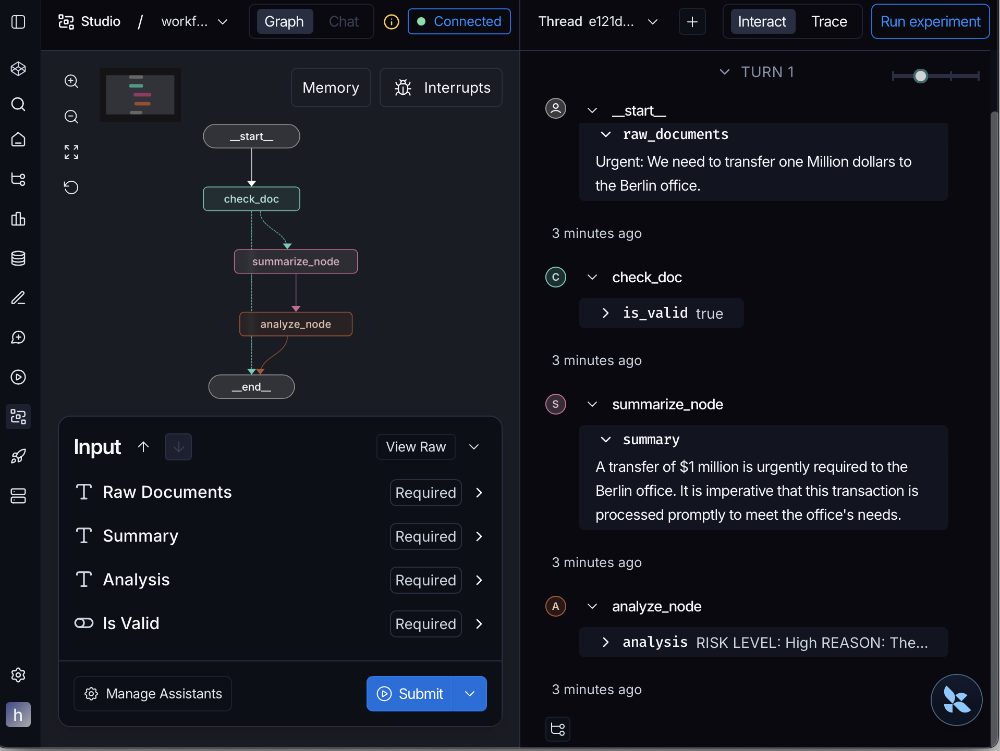

# Stateful AI Document Pipeline: Summarization & Risk Analysis

An intelligent document processing workflow built with LangGraph, LangChain, and 
Groq. This project demonstrates a production-grade approach to handling multi-agent 
document workflows using state management, conditional routing, and high-speed 
Llama 3.3 inference.

---

## Overview

This application processes raw documents through a structured, autonomous pipeline:

1. **Validation** — A gatekeeper node verifies document integrity before consuming 
API tokens.
2. **Summarization** — A professional editor agent condenses the input into a 
concise, 2-sentence brief.
3. **Risk Analysis** — A risk auditor agent evaluates the summary to identify 
high-priority legal or financial risks.

---

## Architecture: The Advantages of LangGraph

While standard linear chains are suitable for simple tasks, LangGraph was selected 
for this project to provide:

- **State Management** — Utilizes a centralized `DocumentState` object to maintain 
data consistency across all nodes.
- **Conditional Routing** — Implements logic-based edges to optimize resource 
usage.
- **Visual Orchestration** — Optimized for LangGraph Studio to allow for real-time 
state inspection and debugging.

---

## Workflow Visualization



*Execution trace captured in LangGraph Studio showing successful validation, 
summarization, and risk detection.*

---

## Technical Stack

| Layer | Technology |
|---|---|
| Orchestration | LangGraph |
| LLM Framework | LangChain |
| Inference Engine | Groq (Llama-3.3-70b-versatile) |
| Development & Debugging | LangGraph Studio / LangSmith |
| Configuration | Pydantic Settings |

---

## Development Environment

The project is configured for **LangGraph Studio** via `langgraph.json`. This 
allows the graph to be imported as a visual service for testing and prompt 
engineering.

**Configuration (`langgraph.json`):**

```json
{
  "graphs": {
    "agent": "./new_agent.py:building",
    "workflow": "./app.py:doc_assistant"
  },
  "env": "./.env",
  "python_version": "3.12",
  "dependencies": ["."]
}
```

---

## Installation and Setup

**1. Clone the repository**

```bash
git clone https://github.com/felixsamuel1640/task-10.git
cd task-10
```

**2. Install dependencies**

```bash
pip install langgraph langchain-groq pydantic-settings
```

**3. Configure environment variables**

Create a `.env` file in the root directory — do not commit this to version control:

```env
GROQ_API_KEY=your_groq_api_key_here
```

**4. Execute the application**

```bash
python app.py
```

---

## Design Principles

- **Separation of Concerns** — Isolated node logic for modularity and easier 
testing.
- **Security** — Leverages Pydantic `SecretStr` to prevent sensitive credentials 
from appearing in logs.
- **Circuit Breaking** — The validation layer prevents downstream execution of 
invalid data, reducing latency and costs.

---

*Developed as part of an AI Engineering internship project at Flexisaf, focusing on 
AI Agentic Workflows.*
