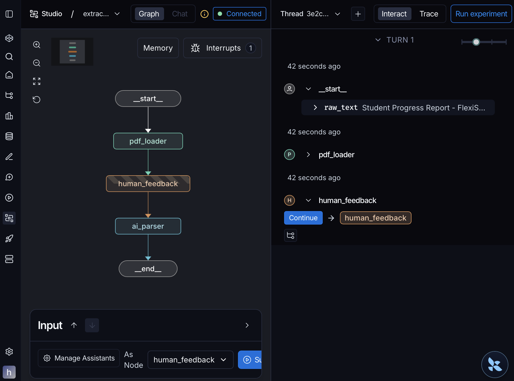
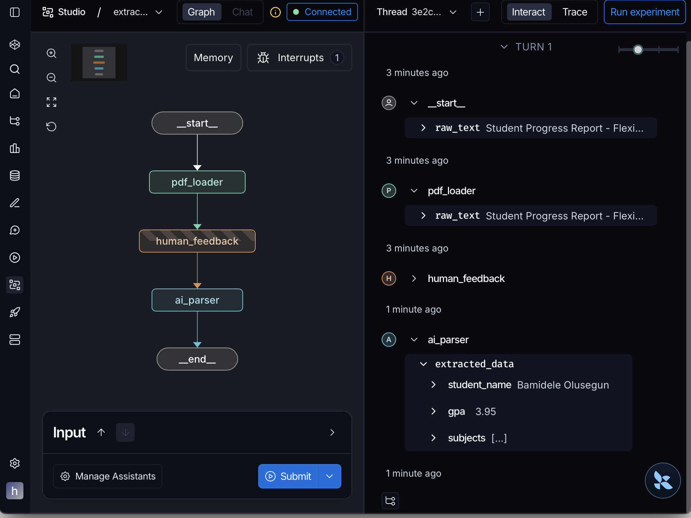

# Student Insight Extraction Agent (Week 11 Deliverable)

## Project Overview

This repository contains the Week 11 deliverable for the FlexiSaf AI Internship. The project 
features a sophisticated **Extraction Agent** designed to transform unstructured academic text 
into validated, structured data.

By leveraging **LangGraph**, the agent implements a Human-in-the-Loop (HITL) architecture, 
ensuring high data precision through manual verification checkpoints before final LLM 
processing. This system is designed to handle complex document layouts where automated 
extraction may require human oversight.

---

## System Architecture

The agent is built as a state-managed graph using the following nodes:

1. **PDF Loader** — Ingests raw text into the `ExtractionState`.
2. **Human Feedback (Breakpoint)** — A strategic interrupt point where the graph pauses, 
allowing a human operator to review the extracted text and provide manual overrides or 
corrections within the LangGraph Studio interface.
3. **AI Parser** — Utilizes the `Llama-3.3-70b` model via Groq with structured output mapping to 
a Pydantic schema.

---

## Key Technical Features

- **Agentic Workflow** — Utilizes `StateGraph` to manage complex data transitions, node 
execution, and state persistence.
- **Human-in-the-Loop (HITL)** — Implements `interrupt_before` logic to prevent automated errors 
in critical academic data fields.
- **Strict Data Validation** — Uses **Pydantic** to enforce data types, ensuring GPA is a float 
and subjects are captured as a list.
- **State Persistence** — Integrated with LangGraph Studio's persistence layer to allow seamless 
pause-and-resume functionality across different threads.

---

## System in Action

### 1. Human-in-the-Loop Interruption

The agent is designed to pause at the `human_feedback` node. This allows for manual data 
verification or text correction before the AI performs the final extraction.



### 2. Structured Data Extraction

Once the "Continue" command is issued, the agent uses the Llama 3.3 model to extract precise 
entities into a validated JSON format.



---

## Evaluation and Observability

To ensure the reliability of the extraction, this project is designed for integration with 
**LangSmith** for production monitoring and evaluation:

- **Traceability** — Every execution step is logged to monitor LLM latency and output 
consistency.
- **Data Curation** — By utilizing manual checkpoints, the system creates a "Gold Dataset" of 
human-verified extractions that can be used for future model benchmarking.
- **Qualitative Review** — The LangGraph Studio interface allows for real-time qualitative 
evaluation of the model's performance against raw document text.

---

## Installation and Usage

**1. Clone the repository**

```bash
git clone https://github.com/felixsamuel1640/Flexisaf-AI-Internship.git
cd Flexisaf-AI-Internship/task-11
```

**2. Configure environment variables**

Create a `.env` file in the root directory:

```env
GROQ_API_KEY=your_api_key_here
```

**3. Install dependencies**

```bash
pip install -r requirements.txt
```

**4. Run the agent**

The agent can be run via the terminal for CLI interaction or loaded into LangGraph Studio for 
the visual experience.

```bash
python extraction_agent.py
```

### Running with LangGraph Studio

This project includes a `langgraph.json` configuration file. If you have LangGraph Studio 
installed, you can simply open this project folder to interact with the graph visually, manage 
threads, and test the Human-in-the-Loop breakpoints.

---

## Project Structure

| File | Description |
|---|---|
| `extraction_agent.py` | Core logic, graph definition, and node functions |
| `requirements.txt` | Necessary dependencies for the environment |
| `langgraph.json` | Configuration file for LangGraph Studio integration |
| `.gitignore` | Ensures sensitive environment files and cache are not tracked |
| `graph_workflow.png` | Visual representation of the agentic state machine |
| `extraction_results.png` | Proof of structured output and data validation |

---

*Developed as part of the FlexiSaf AI Internship Program — Week 11.*
