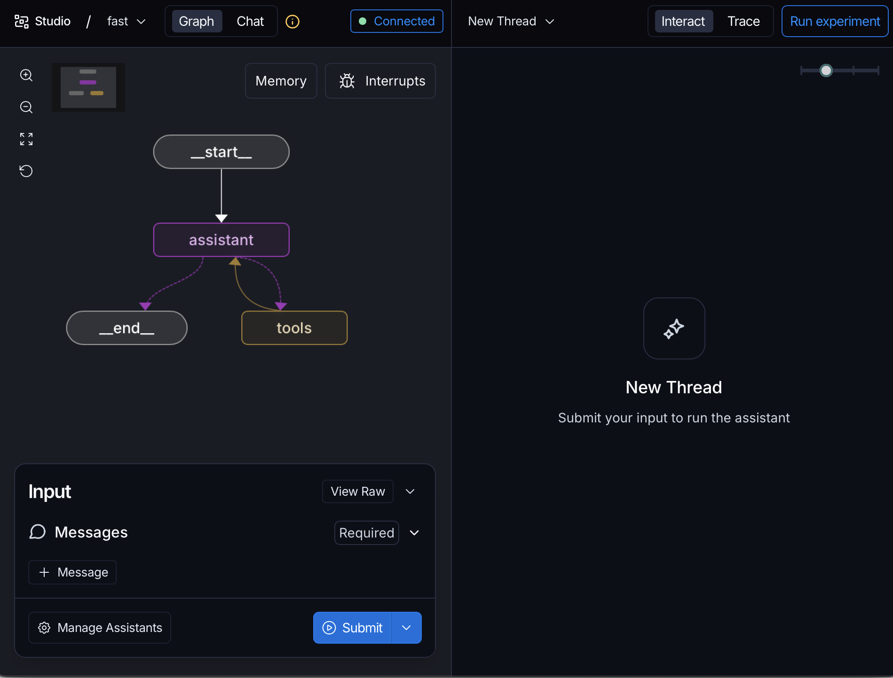
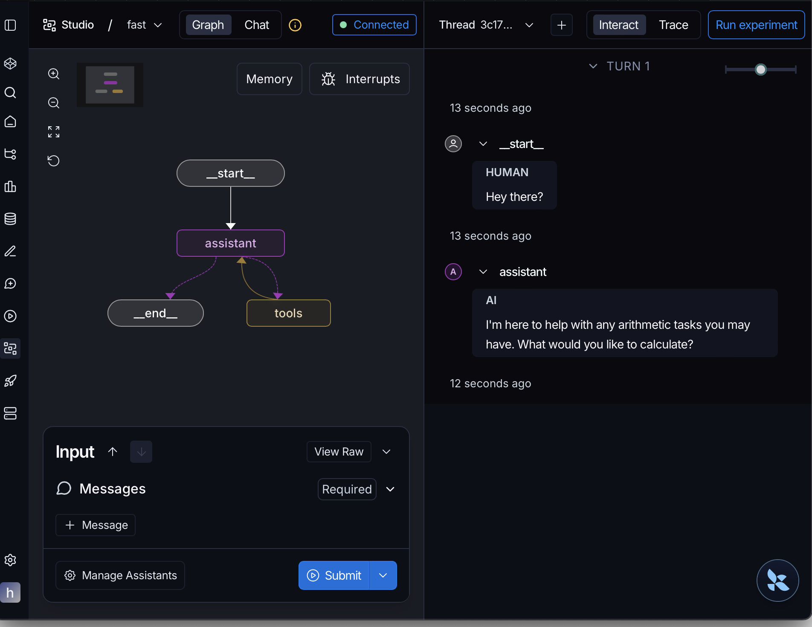
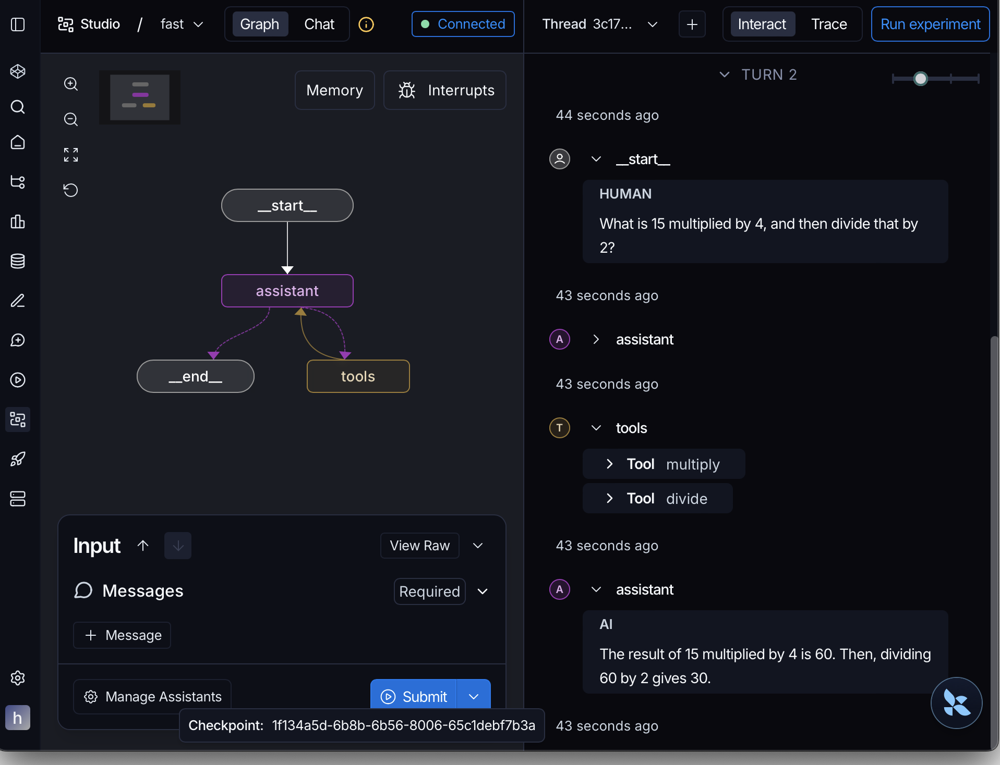
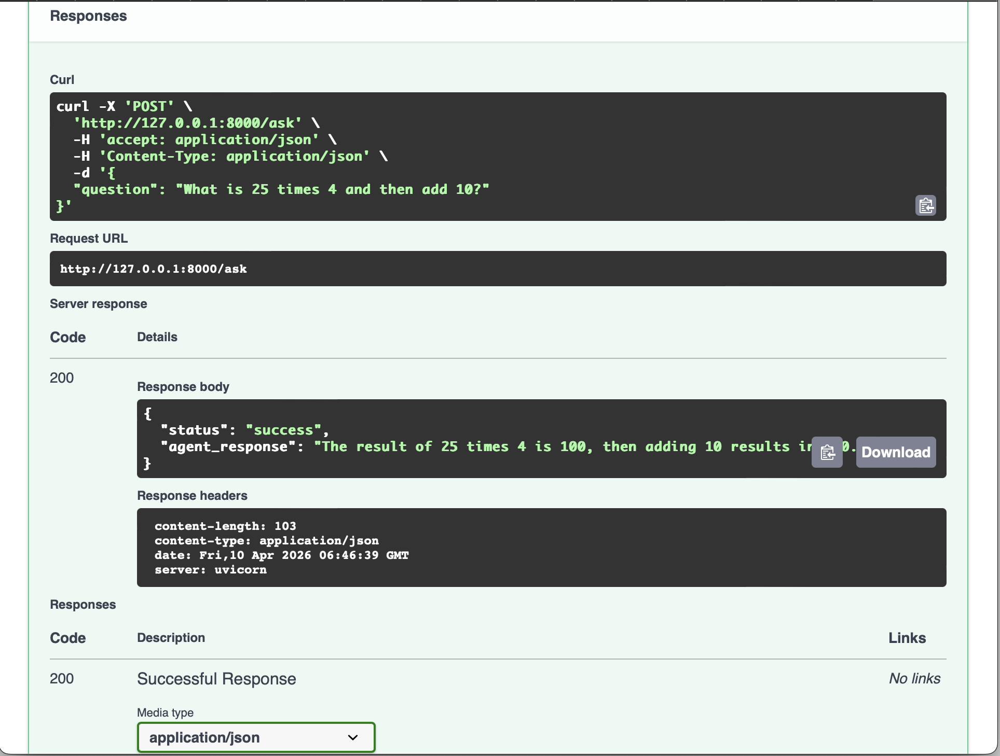
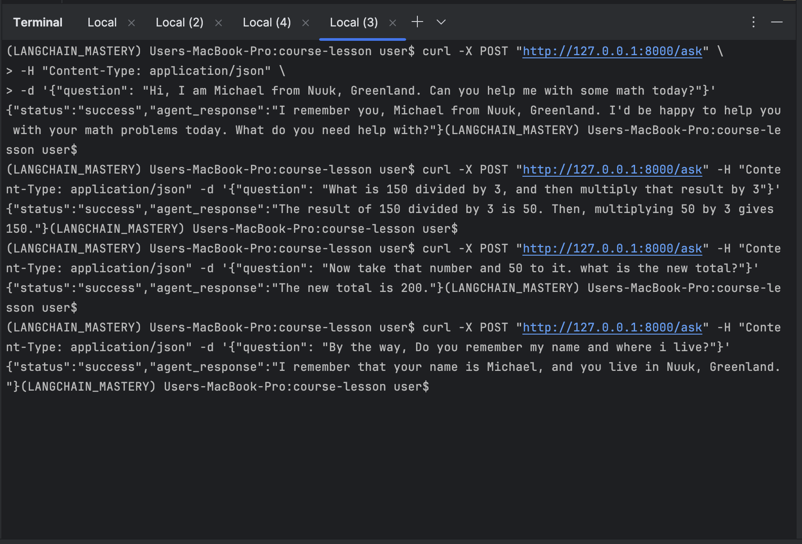

# Task 12: Stateful Arithmetic AI Agent (REST API)

## Project Overview
This project implements a **ReAct (Reasoning and Action) Agent** capable of performing 
multi-step arithmetic operations. Built with **LangGraph** and **LangChain**, the agent is 
wrapped in a **FastAPI** REST interface, allowing for local deployment and programmatic 
interaction via JSON.

Beyond simple calculation, this agent features **stateful memory persistence**, enabling it to 
remember user context and previous calculation results across multiple API calls.

---

## Key Features
- **Mathematical Tools:** Specialized tools for `Addition`, `Subtraction`, `Multiplication`, and 
`Division`
- **Stateful Reasoning:** Uses `MemorySaver` to maintain a conversation thread, allowing for 
follow-up questions
- **RESTful API:** Developed with FastAPI, providing structured JSON responses
- **Interactive Documentation:** Automatic Swagger UI generation for easy endpoint testing
- **Visual Debugging:** Graph logic verified and visualized via LangGraph Studio

---

## ️Visualizing the Logic (LangGraph Studio)
The agent's decision-making process was validated using **LangGraph Studio**. This allowed for 
real-time tracking of how the `assistant` node decides to call specific `tools` and how the 
state is updated.

### Initial vs. Active State

| Initial Graph Structure | Active Execution Path |
|------------------------|----------------------|
|  |  
|

### Execution Result
The graph below shows a successful "ReAct" loop where the agent identifies the need for tools, 
executes them, and returns a summarized response.



---

## API Deployment & Documentation
The application is served locally using **Uvicorn**. FastAPI provides an interactive **Swagger 
UI** to explore the endpoints.

- **API Endpoint:** `POST /ask`
- **Documentation URL:** http://127.0.0.1:8000/docs



---

## 💻 Terminal Verification (Memory & Tool Testing)
To verify the **REST API** and **Memory Persistence**, a series of sequential `curl` commands 
were executed. The following logs demonstrate the agent correctly maintaining user identity and 
mathematical state across four distinct requests.



### Validation Observed
1. **Context Establishment:** Agent identifies the user as "Michael from Nuuk"
2. **Tool Chaining:** Agent performs `(150 / 3) * 3` correctly
3. **State Persistence:** User asks to "add 50 to that number." The agent retrieves the previous 
result (`150`) from memory and returns `200`
4. **Identity Recall:** The agent remembers the user's name and location at the end of the 
session

---

## Installation & Usage

### 1. Prerequisites
- Python 3.9+
- OpenAI API Key (or compatible LLM provider)

### 2. Setup
Clone the repository and install the required packages:

```bash
pip install -r requirements.txt
```

### 3. Environment Variables
Create a `.env` file in the root directory:

```env
OPENAI_API_KEY=your_actual_key_here
```

### 4. Run the API
Start the server using Uvicorn:

```bash
uvicorn fast_api_agent:app --reload
```

### 5. Test the API
You can test the endpoint using `curl`:

```bash
curl -X POST "http://127.0.0.1:8000/ask" \
     -H "Content-Type: application/json" \
     -d '{"question": "What is 25 times 4?"}'
```
*Developed as the Week 12 Project for the FlexiSaf AI Engineering Internship.*
